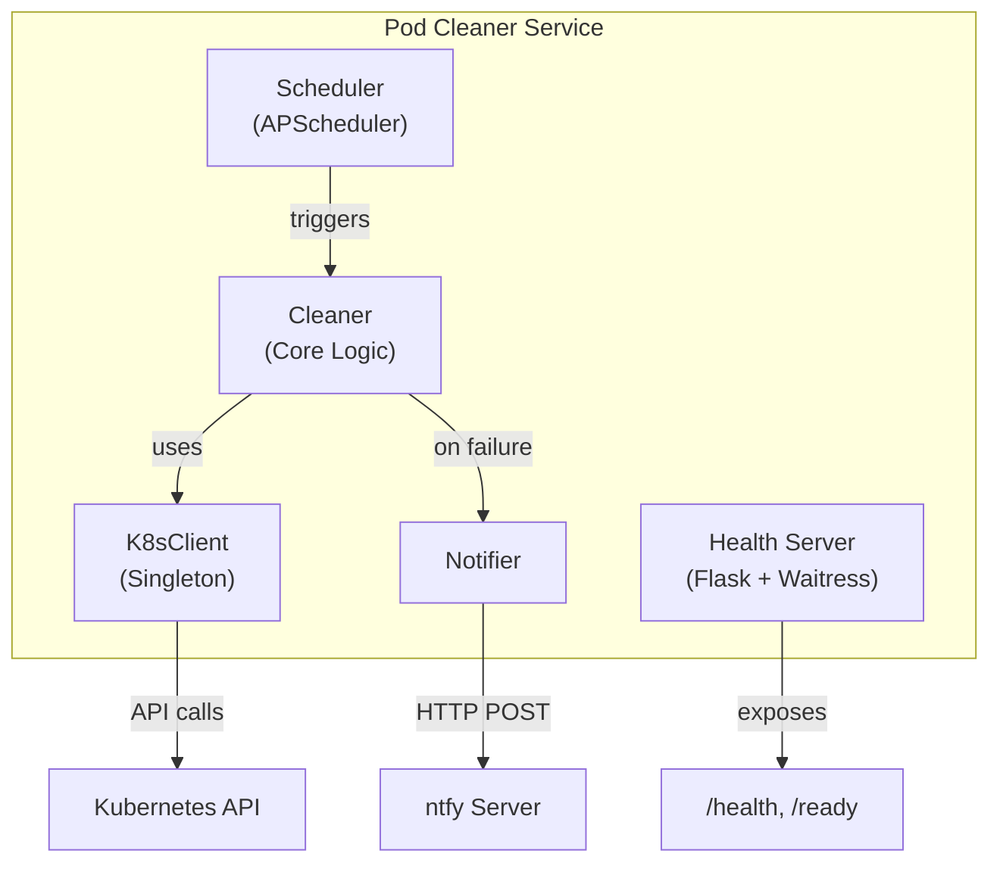
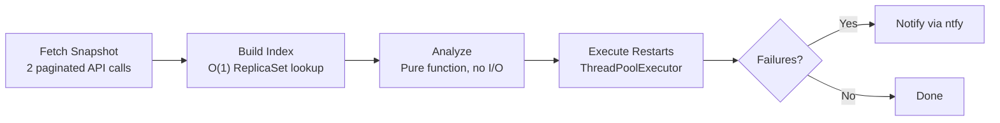
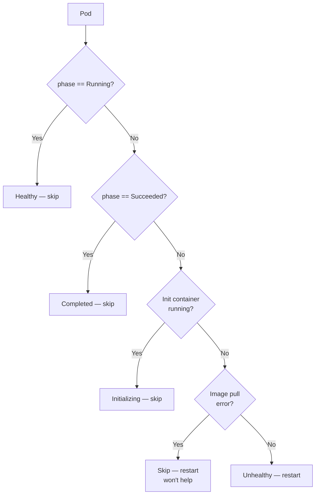

# Pod Cleaner

A Kubernetes service that detects unhealthy pods and triggers rollout restarts on their parent Deployment or StatefulSet.

## Features

- Snapshot-based detection: 2 paginated API calls capture the full cluster, then everything runs in memory
- Rollout restart instead of direct pod deletion
- Skips image pull errors
- Groups unhealthy pods by controller to avoid duplicate restarts
- Concurrent restart via ThreadPoolExecutor
- Failure alerts via [ntfy](https://ntfy.sh/)
- `/health` and `/ready` endpoints for Kubernetes probes
- Graceful shutdown on SIGTERM/SIGINT

## Architecture



### Snapshot-Based Processing

The traditional approach is to list namespaces, then list pods per namespace, then query ReplicaSets per pod — resulting in N+2 API calls that scale with cluster size. This project takes a different approach:

```
List All Pods (paginated) + List All ReplicaSets (paginated) → Build Index → In-Memory Processing
```



Two paginated API calls fetch all pods and ReplicaSets. `ClusterSnapshot` builds a `(namespace, name) → ReplicaSet` hash map. A pure function then walks the snapshot, identifies unhealthy pods, traces ownership to Deployment/StatefulSet, and groups by controller — all without additional API calls. Restarts are dispatched to a thread pool.

The tradeoff is memory: the snapshot is proportional to cluster size. In practice this is fine — pod metadata is lightweight, and the snapshot is discarded after each cycle. `PAGE_SIZE` controls pagination to avoid API server timeouts.

## Design Decisions

- Single application, not microservices: The task doesn't warrant independent scaling of components. No message queues or shared state needed.
- Singleton K8s client with double-checked locking: Shares one connection pool across all threads, avoids re-loading kubeconfig on every call, and is easy to mock in tests.
- Only Deployment/StatefulSet pods: `rollout restart` only applies to these controllers. Deleting DaemonSet or Job pods could cause unintended side effects. These workload types have their own reconciliation mechanisms.
- ThreadPoolExecutor over asyncio: The official `kubernetes` Python client is synchronous. Threads are simpler to reason about, and the concurrency is bounded by `MAX_WORKERS` (default 10).
- Skip image pull error pods: Restarting a pod stuck on `ErrImagePull` or `ImagePullBackOff` just reproduces the same failure. Kubernetes itself retries image pulls with backoff, so these pods will recover once the underlying issue is fixed.

## Pod Health Check Logic



## Configuration

| Environment Variable       | Description                      | Default      |
| -------------------------- | -------------------------------- | ------------ |
| `CLEANUP_INTERVAL_MINUTES` | Cleanup cycle interval (minutes) | `10`         |
| `MAX_WORKERS`              | Concurrent restart threads       | `10`         |
| `HEALTH_PORT`              | Health check server port         | `8080`       |
| `LOG_LEVEL`                | Logging level                    | `INFO`       |
| `PAGE_SIZE`                | API pagination page size         | `500`        |
| `NTFY_URL`                 | ntfy server URL                  | _(disabled)_ |
| `NTFY_TOKEN`               | ntfy auth token                  | _(none)_     |
| `NTFY_TIMEOUT`             | ntfy request timeout (seconds)   | `10`         |

## Quick Start

### Prerequisites

- Kubernetes cluster
- kubectl configured
- Container Image Registry
- Docker

### Deploy

```bash
docker build -t pod-cleaner:latest .
docker tag pod-cleaner:latest your-registry/pod-cleaner:latest
docker push your-registry/pod-cleaner:latest

kubectl apply -f k8s/rbac.yaml
kubectl apply -f k8s/deployment.yaml  # update image reference first

kubectl -n pod-cleaner get pods
kubectl -n pod-cleaner logs -f deployment/pod-cleaner
```

### Notifications (Optional)

Uncomment `NTFY_URL` in `k8s/deployment.yaml`. For auth, create a secret and uncomment the `NTFY_TOKEN` section. Re-apply the deployment.

## Local Development

```bash
python -m venv venv
source venv/bin/activate
pip install -r requirements-dev.txt

# Tests
pytest
pytest --cov=src --cov-report=html

# Run locally (requires kubeconfig)
export CLEANUP_INTERVAL_MINUTES=1 LOG_LEVEL=DEBUG
python -m src.main
```

## Security

- Non-root user (UID 1000), read-only root filesystem
- All Linux capabilities dropped, privilege escalation disallowed
- Minimal RBAC: `list`/`get` for read, `patch` for restarts only
- No secrets in code or images
